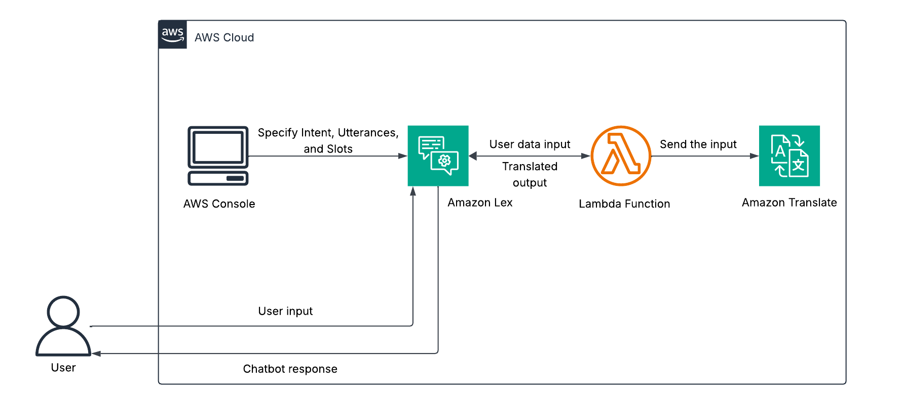
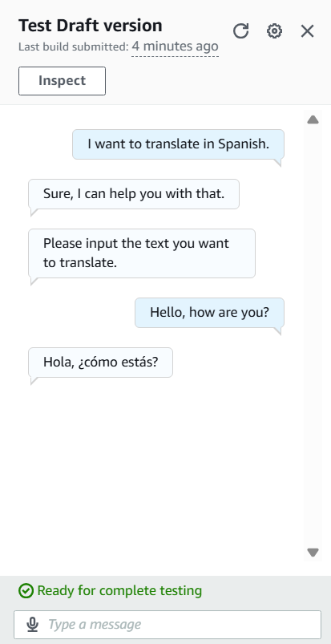

# AWS Lex Language Translation Bot
This project implements a serverless, AI-driven chatbot using **Amazon Lex** that translates user input into multiple languages in real time. The bot captures spoken or typed text, passes slot values to **AWS Lambda**, and uses **Amazon Translate** to return the translated result back to Lex. It includes a Lambda function, **SAM template** for packaging/deployment, and **Terraform** files for provisioning equivalent resources. The solution demonstrates how to integrate AWS AI/ML services into a conversational interface while following Infrastructure-as-Code best practices.

## Architecture Overview
  
*Figure 1: Architecture diagram of the AWS Lex Language Translation Bot.*

- **Amazon Lex Bot** – Captures user text/voice, parses the `TranslateIntent`, and provides slots (`text`, `language`) to Lambda.
- **AWS Lambda Function** – Validates slot values, invokes Amazon Translate, and returns a Lex-formatted response.
- **Amazon Translate** – Auto-detects source language and translates into the requested target language.
- **IAM Role** – Grants Lambda permissions for Translate and basic execution logs.
- **Lambda Permission** – Allows Lex V2 to invoke the Lambda function.

## Skills Applied
- Designing conversational interfaces with Amazon Lex.
- Implementing serverless architecture patterns using AWS Lambda.
- Integrating AWS AI/ML services for real-time translation.
- Automating deployments with AWS SAM and Terraform.
- Managing IAM roles and policies following least privilege.
- Structuring Infrastructure-as-Code for portability and scalability.
- Testing serverless functions with simulated Lex events.

## Features
- Translate text into **French**, **Japanese**, **Chinese**, **Spanish**, **German**, or **Norwegian**.
- Auto-detect source language for flexible inputs.
- Serverless architecture with minimal operational overhead.
- Deployable with **AWS SAM** or **Terraform**.
- Easily extensible for additional languages and channels.

## Tech Stack
- **Languages:** Python 3.x
- **AWS Services**: Lex (V2), Lambda, Translate, IAM
- **IaC Tools:** AWS SAM, Terraform
- **Other Tools:** AWS CLI

## Deployment Instructions
> **Note:** All command-line examples use `bash` syntax highlighting to maximize compatibility and readability. 

> If you are using PowerShell or Command Prompt on Windows, the commands remain the same but prompt styles may differ.

> Lex resources are managed through the console for simplicity, but the IaC templates demonstrate the key serverless infrastructure (Lambda, IAM) in both SAM and Terraform. This highlights flexibility across IaC frameworks.
 
To provision the required AWS infrastructure, deploy using **SAM** or **Terraform** templates as included in this repository.

### Option 1: **SAM**
1. Navigate to the `cloudformation` folder, build, and deploy:
   ```bash
   cd cloudformation
   sam build
   sam deploy --guided --capabilities CAPABILITY_NAMED_IAM
   ```

2. Provide parameters when prompted (Stack Name, AWS Region, etc.).

### Option 2: **Terraform**
1. Edit variables in `terraform.tfvars` and/or `variables.tf` to customize the deployment.
   
2. Navigate to the `terraform` folder and deploy:
   ```bash
   cd terraform
   terraform init
   terraform plan # Optional, but recommended.
   terraform apply
   ```

**Note**: Python 3.12 is recommended and tested for this project. Ensure your PATH environment variable includes the following entries (with priority above other Python versions):
- `..\Python312\`
- `..\Python312\Scripts`  

Also confirm the AWS CLI is configured (`aws configure`) with credentials that have sufficient permissions to deploy **Lambda functions** and manage **IAM roles**.

## How to Use
1. **Deploy the infrastructure** using SAM or Terraform.

2. **Create the Lex bot manually in the AWS Management Console**, following these steps: create the bot, add the `TranslateIntent` with slots (text, language), configure utterances, and attach the Lambda fulfillment function. See [LEX_SETUP.md](assets/LEX_SETUP.md) for full details.

3. **Test the Lambda function directly**. The file `../src/events/event.json` can be used to test the function.  

   **3a. Use the AWS CLI:**

     ```bash
     aws lambda invoke \
	 --function-name translation-lambda \
	 --invocation-type RequestResponse \
	 --payload fileb://src/events/event.json \
	 src/events/response.json
     ```

   **3b. Use the AWS Management Console:**
   - Navigate to **Lambda** and select the function.  
   - Select **Test**.
	 - Select **Create new event**
   - Enter an **Event name**.
   - In Event JSON, enter the contents of the event.json file.
   - Select **Test** in the upper right of the Test event dialog.

4. **Test the Chatbot**. Click **Test** in the upper right hand side of the Intent screen and enter text that aligns with the utterances configured.

## Project Structure
```plaintext
aws-lex-language-translation-bot/
├── assets/                      # Images, diagrams, screenshots
│   ├── architecture-diagram.png      # Project architecture
│   ├── screenshot.png    			  # Application screenshot
│   └── LEX_SETUP.md				  # Lex Setup instructions
├── cloudformation/              # AWS SAM template
│   └── template.yaml                 # Main SAM template
├── terraform/                   # Terraform templates
│   ├── main.tf                       # Main Terraform config
│   ├── variables.tf                  # Input variables
│   ├── outputs.tf					  # Exported values
│   ├── terraform.tfvars              # Default variable values
│   ├── providers.tf			      # AWS provider definition
│   └── versions.tf					  # Terraform version constraint
├── src/                         # Lambda source code and events
│   ├── translate_function/		      # Lambda function
│	│   └── translate_function.py         
│   └── events/						  # Lambda test events
│       └── event.json                     
├── LICENSE                      
├── README.md                    
└── .gitignore                   
```

## Screenshot


*Figure 2: Amazon Lex Language Translation Bot Input/Output Example

## Future Enhancements
- Customizing `FallbackIntent` response and adding more utterances/intents.
- Multi-turn flows for clarification or language detection confirmations.
- Expanding supported languages and synonyms for the `language` slot.
- Voice-to-text via Amazon Transcribe for richer experiences.
- Web UI (e.g., React) using AWS Amplify for chat embedding.
- CloudWatch metrics & alarms for Lambda errors.
- Adding retries or DLQ for failed Lambda invocations.
- CI/CD with GitHub Actions and SAM CLI.

## License
This project is licensed under the [MIT License](LICENSE).

---

## Author
**Patrick Heese**  
Cloud Administrator | Aspiring Cloud Engineer/Architect  
[LinkedIn Profile](https://www.linkedin.com/in/patrick-heese/) | [GitHub Profile](https://github.com/patrick-heese)

## Acknowledgments
This project was inspired by a course from [techwithlucy](https://github.com/techwithlucy).  
The Lambda function code is taken directly from the author's original implementation.  
The architecture diagram included here is my own version, adapted from the original course diagram.  
I designed and developed all Infrastructure-as-Code (CloudFormation, SAM, Terraform) and project documentation.  
